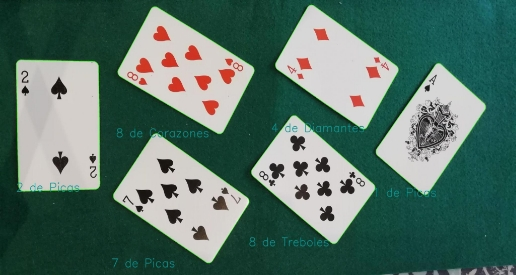

# Detecciónde cartas con OpenCV

04/09/2024

VISIÓN POR COMPUTADOR EN LA INDUSTRIA 

MUAII 

UPV 

### Visión general

El objetivo principal de este proyecto es tomar diferentes imágenes de cartas de poker y diseñar un algoritmo para poder clasificarlas dependiendo del tipo de carta.

### Objetivos

1. Crear un algoritmo de clasificación de cartas mediante OpenCV.
1. Evaluación de resultados.

**Índice**

1. [Obtención de las imágenes y detección de los contornos de las cartas.](#_page2_x72.00_y162.00)
1. [Detección de palo y número en cada carta.](#_page3_x72.00_y88.50)
1. [Análisis de resultados.](#_page5_x72.00_y110.25)

## Análisis del algoritmo empleado.

### 1. Obtenciónde las imágenes y detección de los contornos de las cartas.

   Explicación:

Para empezar debemos encontrar los contornos de las cartas, para ello, se procedio a leer las imagenes y aplicar un threshold que nos devolvió una imagen binaria de la original donde el tapete se volvia 0 (negro) y las cartas 1(blanco).

En esta imagen binaria podremos usar el método de cv2.findContours para para encontrar todos los contornos de la imagen.

Por último filtraremos los contornos en función de su área para descartar los más pequeños y quedarnos solo con los contornos de las cartas.

Estos contornos serán anexados a una lista con todos los contornos de cartas en la imagen.

### 2. Detección de palo y número en cada carta.

Explicación:

Para cada contorno se procede a averiguar cual es el rectángulo de menor área que puede contener ese contorno con cv2.minAreaRect() donde obtendremos los puntos de ese rectángulo.

Ahora tenemos que saber cómo están colocados esos puntos en el espacio para poder saber cuánto girar la carta. Para eso se procedió a la creación de la función auxiliar averiguar\_puntoVert(box).

Dependiendo de si la carta está girada en el sentido de las agujas del reloj o en el sentido contrario a las agujas del reloj, procederemos a girar la carta para que en el eje de las x quede su lado más corto y en el de las y su lado más largo.

Después recortamos la imagen para obtener solo la carta de interés y la hacemos de un tamaño uniforme, en este caso (800,1224).

Queremos que todas las imágenes sean iguales para que al comparar con nuestras máscaras de números y palos obtenidas de imágenes de cartas de ese tamaño obtengamos resultados apropiados.

Ahora para incrementar la robustez del algoritmo giraremos la carta 180 grados ya que los números son simétricos en ambas esquinas y compararemos nuestra máscara solo en la esquina superior izquierda de la carta. Esto se hace para hacer el algoritmo más rápido que si se compara la plantilla con toda la carta.

 

*Imágenes usadas como plantillas del número.*

Con los valores que nos devuelve la función match template localizamos los mínimos de cada template. El mínimo de entre todas será el número y el palo de la carta.

Por último procedemos a indicar en la imagen original el palo y número detectado de cada carta.

 

**¿Porqué rotar la carta 180 grados?**

La cámara tiene distorsiones radiales que hará que las cosas parezcan más pequeñas a medida que se alejan de su centro de imagen. eso hará que las cartas no parezcan rectángulos perfectos y por tanto un rectángulo comprenderá un poco más que el perímetro de la carta detectado. Se puede apreciar que al rotar la carta 180 grados las comparaciones con nuestra plantilla darán mejores resultados. Una solucion mas facil seria calibrar intrínsecamente la cámara pero carecemos de datos para ello.

### 3. Análisis de resultados

Imagen 13 de Test_2

Imagen 2 de Test_2

**

Tabla de resultados

Se consiguieron 102 aciertos de 104 cartas lo cual da una **precisión de 0.981.** La única imagen en la que hubo fallos fue la dos en la que cabe resaltar que las cartas estaban bastante difuminadas.
